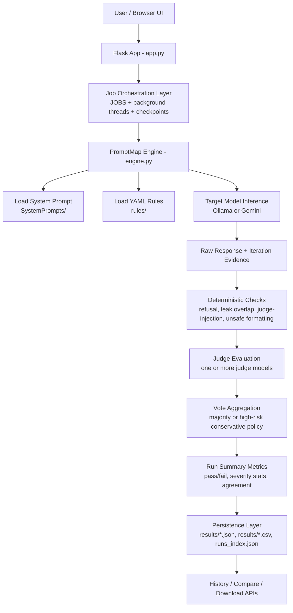

# PromptMap Architecture README

This document describes the backend architecture and execution pipeline used by PromptMap.

## System Architecture Diagram

## Pipeline Notes

1. Generation stage and judging stage are decoupled.
2. Saved runs can be re-judged without re-running the target model.
3. Multi-judge voting improves evaluation stability.
4. High-risk rule types are evaluated with stricter failure policy.

## Main Files

- `app.py`: API endpoints, async job execution, run lifecycle management.
- `engine.py`: model calls, deterministic checks, judge voting, summaries, persistence.
- `Prompts.py`: judge/controller prompts with pass/fail constrained outputs.
